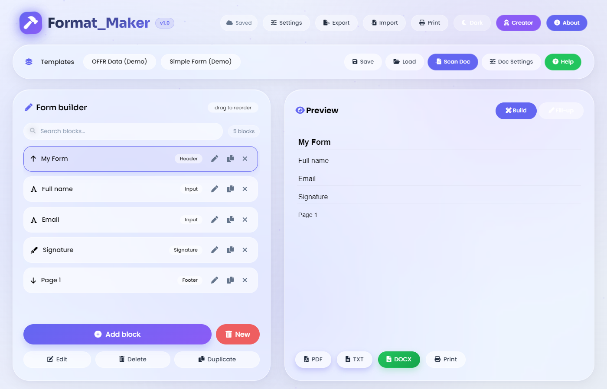

<div align="center">

# Format_Maker

**Build, fill, and export printable forms — entirely in your browser.**

[Features](#-features) · [Quick start](#-quick-start) · [Shortcuts](#-keyboard-shortcuts) · [Project layout](#-project-layout) · [License](#-license)

[](LICENSE)
[](index.html)
[](#-privacy)

</div>

---



**Format_Maker** is a form builder *and* document scanner that runs entirely in the
browser. Compose a form from blocks, fill it in, then export it as **PDF, DOCX, TXT**,
**JSON**, or send it straight to the **printer**. You can also feed it an existing
PDF/DOCX and it will detect the form structure and turn it into editable blocks.

There is no backend, no account, and no upload. Your documents never leave your machine.

---

## ✨ Features

### Building
- **11 block types** — input, heading, sub-heading, sub-sub-heading, signature, header,
  footer, page number, table, and nested numbered outlines.
- **Drag to reorder**, or focus a block and use <kbd>↑</kbd>/<kbd>↓</kbd>.
- **Per-block typography** — font family (11 options), size, bold/italic/underline,
  alignment, indentation, and spacing.
- **Custom tables** — resize rows/columns and edit cells inline; tables also nest inside outlines.
- **Search and filter** blocks in long scanned documents (<kbd>Ctrl</kbd>+<kbd>F</kbd>).
- **Undo/redo** history (<kbd>Ctrl</kbd>+<kbd>Z</kbd> / <kbd>Ctrl</kbd>+<kbd>Shift</kbd>+<kbd>Z</kbd>).

### Document settings
- **Editable letterhead** — any number of lines, each with its own text, alignment,
  size, and bold toggle.
- **Configurable footer** — a format string where `{page}` and `{totalPages}` are
  substituted, with left/center/right alignment.
- **Live paper preview** so you can see the header/footer before exporting.

### Export
| Format | Notes |
|---|---|
| **PDF** | jsPDF + AutoTable, letterhead repeats on every page, real page numbers |
| **DOCX** | Fully editable in Word / Google Docs |
| **TXT** | Plain text |
| **JSON** | Round-trips the whole form: blocks + letterhead/footer + answers |
| **Print** | Dedicated print stylesheet — the app chrome never reaches the paper |

### Scanning
- Drop in a **PDF** or **DOCX** and it detects headers, input fields, sub-headings,
  signatures, page numbers, and footers, then builds the form for you.
- Sample documents are downloadable from the **Help** dialog to test the scanner.

### Interface
- **Glassmorphism** design with an animated gradient background and floating particles.
- **Poppins** typeface throughout the app chrome (form blocks keep their own font, so
  exported documents are unaffected).
- **Dark mode** that remembers your choice, plus a light/dark accent-colour system.
- **Responsive** down to phone widths; keyboard accessible with focus traps in dialogs.
- **Autosave** with a "Saving…/Saved" indicator.
- **Template carousel** — two built-in demos plus your own saved templates.

---

## 🚀 Quick start

It's a static site — there is nothing to build.

```bash
# Option 1: serve it (recommended — enables the built-in demo templates)
python -m http.server 8000
# or, if you have Node installed:
npx serve .
```

Then open <http://localhost:8000>.

> **Why use a server?** The app is pure HTML/CSS/JS with no build step. Opening
> `index.html` directly works too, but browsers block `fetch()` on `file://`, so the
> two bundled demo templates simply won't load. Everything else works either way.

### Deploying

Because it's static, any static host works — GitHub Pages, Netlify, Vercel,
Cloudflare Pages. No configuration needed beyond pointing the host at the repo root.

### Tests

```bash
npm test
```

Runs a dependency-free smoke suite covering the export/import round-trip, the
storage migration, and HTML escaping in the print and letterhead paths.

---

## ⌨️ Keyboard shortcuts

| Shortcut | Action |
|---|---|
| <kbd>Ctrl</kbd>+<kbd>F</kbd> | Search blocks |
| <kbd>Ctrl</kbd>+<kbd>D</kbd> | Duplicate the selected block |
| <kbd>Ctrl</kbd>+<kbd>Z</kbd> | Undo |
| <kbd>Ctrl</kbd>+<kbd>Shift</kbd>+<kbd>Z</kbd> | Redo |
| <kbd>↑</kbd> / <kbd>↓</kbd> | Reorder the focused block |
| <kbd>Esc</kbd> | Close the topmost dialog |

---

## 📁 Project layout

```
.
├── index.html            # Single page: markup + CDN loader
├── style.css             # All styling (glass UI, dark mode, print styles)
├── js/
│   ├── app.js            # Entry point — wiring and event listeners
│   ├── state.js          # Blocks, selection, settings, autosave, undo/redo
│   ├── renderer.js       # Block list, live preview, template carousel
│   ├── modal.js          # Add/edit block dialog (tables + outline editors)
│   ├── settings.js       # Letterhead & footer editor  ← new
│   ├── formio.js         # JSON export/import + printing ← new
│   ├── exporter.js       # PDF / DOCX / TXT generation
│   ├── preview.js        # In-app export previews
│   ├── scanner.js        # PDF/DOCX → blocks
│   ├── sample.js         # Sample document generator
│   └── util.js           # Shared helpers (escaping, fonts, toasts, focus trap)
├── templates/            # Built-in demo forms (DEMO1.json, DEMO2.json)
├── test/                 # Smoke tests (node test/smoke.test.mjs)
├── assets/               # Favicon, screenshot, social preview
└── "From The Creator"/   # Creator photo + donation QR
```

**Architecture:** plain ES modules, no framework, no bundler. `state.js` is the single
source of truth; everything else renders from it or writes to it through its API.

---

## 🛡️ Privacy

Everything stays on your machine. Forms, fill-up answers, templates, and preferences
are stored in your browser's `localStorage` and nowhere else. Scanning and export both
run locally — your documents are never uploaded to a server.

---

## 🧰 Built with

[jsPDF](https://github.com/parallax/jsPDF) ·
[jsPDF-AutoTable](https://github.com/simonbengtsson/jsPDF-AutoTable) ·
[PDF.js](https://mozilla.github.io/pdf.js/) ·
[Mammoth.js](https://github.com/mwilliamson/mammoth.js) ·
[docx](https://github.com/dolanmiu/docx) ·
[Font Awesome](https://fontawesome.com) ·
[Poppins / Sora / Inter](https://fonts.google.com)

All loaded from a CDN with automatic fallback mirrors. If a library can't be reached,
the affected feature is disabled and a banner explains why instead of failing silently.

---

## 🤝 Contributing

Contributions are welcome — see [CONTRIBUTING.md](CONTRIBUTING.md). For anything more
than a typo, please [open an issue](https://github.com/VortexProtocol1633/Format_Maker/issues)
first so we can agree on the approach.

---

## 📄 License

Released under the [MIT License](LICENSE). © 2026 Md Masrur Masuk Shopnil

If Format_Maker saves you time, consider [buying the creator a coffee](https://github.com/VortexProtocol1633/Format_Maker) ☕